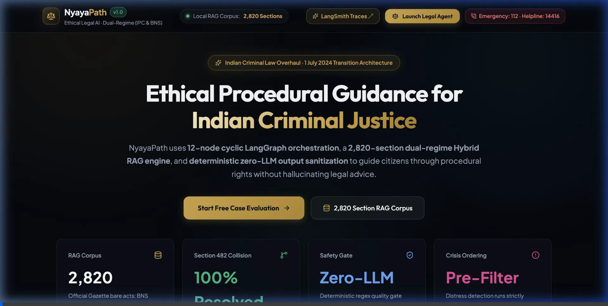
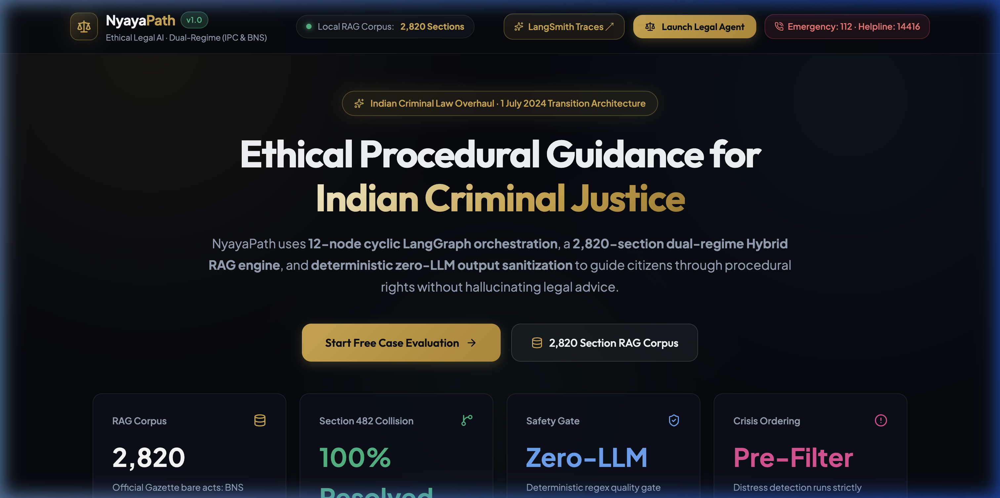
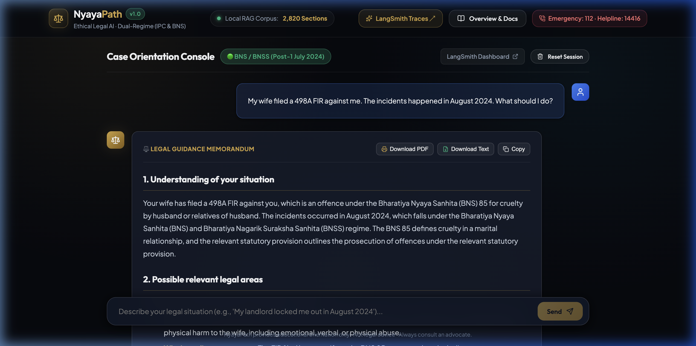
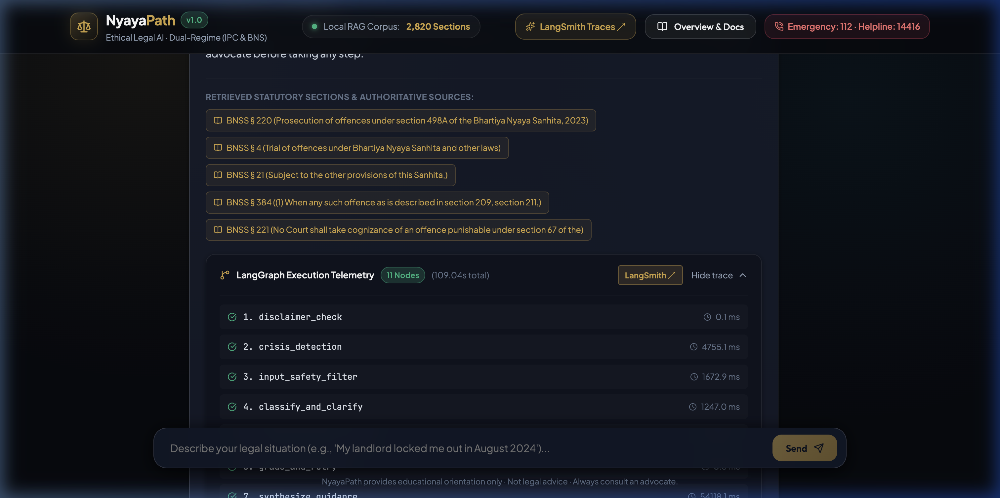
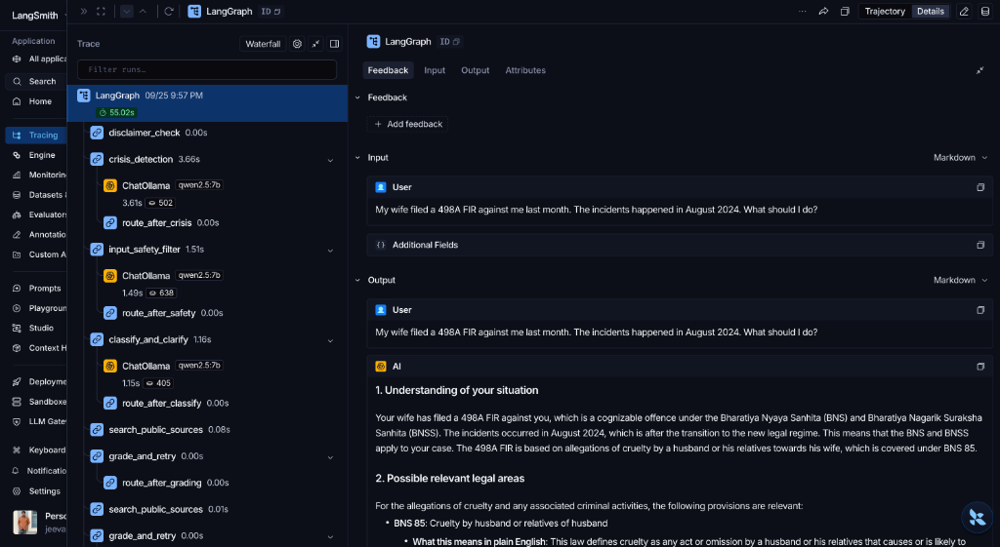
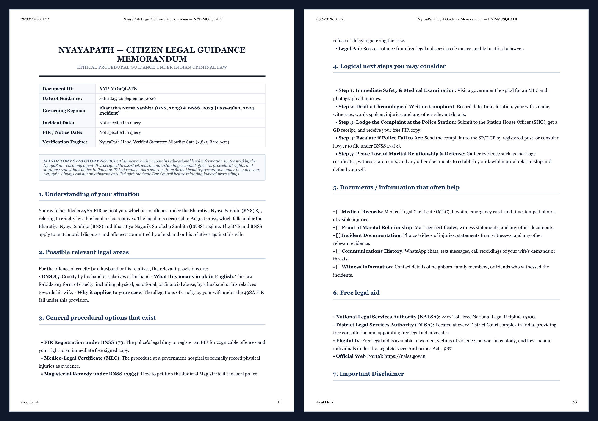
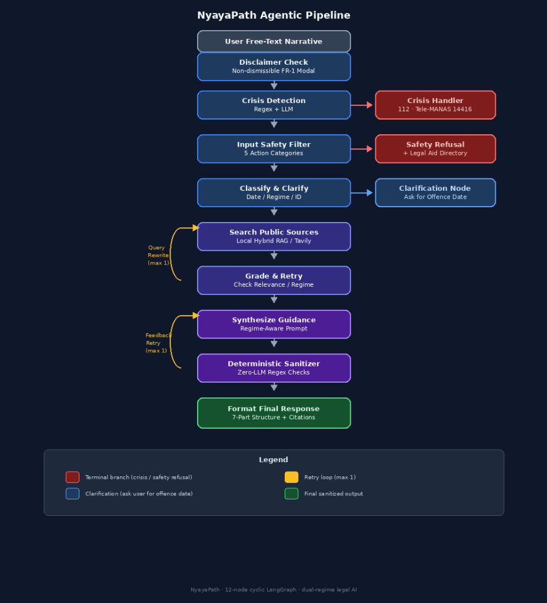
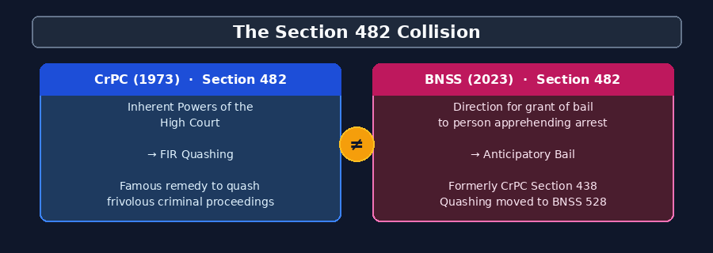

# ⚖️ NyayaPath — Ethical Legal Guidance Agent

> **Portfolio / Educational Project** — Demonstrates advanced agentic AI engineering, deterministic guardrails, and domain-specific legal reasoning.  
> **NOT a legal service. NOT legal advice.**

[](https://www.python.org/downloads/)
[](https://github.com/langchain-ai/langgraph)
[-purple.svg)](https://www.trychroma.com/)
[](https://fastapi.tiangolo.com/)
[](https://react.dev/)
[](https://ollama.com)
[](https://smith.langchain.com)

NyayaPath is an agentic AI system that accepts a citizen's natural-language account of a legal grievance (as complainant or accused) and generates structured, plain-language procedural guidance under Indian criminal law.

**It strictly never provides legal advice, never guarantees court outcomes, and never suggests strategies to evade the law.**

---

## 🎯 Engineering Highlights (Recruiter Summary)

| Core Engineering Challenge | Production-Grade Implementation in NyayaPath |
|---|---|
| **Agentic StateGraph Orchestration** | **12-node cyclic LangGraph architecture** featuring conditional routing, early exit terminals, automated query reformulation, and compiler-like self-correction retry loops. |
| **Dual-Regime Local Hybrid RAG** | **2,820 authentic statutory sections** indexed across IPC, CrPC, BNS, and BNSS. Combines dense semantic vector embeddings (`all-MiniLM-L6-v2`) and sparse lexical search (BM25) via **Reciprocal Rank Fusion (RRF)** with metadata regime partitioning. |
| **Critical Section Collision Resolution** | Prevents catastrophic legal misdirection around the **Section 482 collision** (CrPC High Court Quashing vs BNSS Anticipatory Bail) via date-of-offence temporal routing (Article 20(1) constitutional principle). |
| **Deterministic Quality Gates** | **Pure Python zero-LLM output sanitizer** enforcing strict statutory section allowlists, mandatory educational disclaimers, and banning outcome predictions ("will win / be acquitted"). |
| **Two-Stage Asymmetric Safety & Crisis** | High-recall crisis detection (Regex + LLM) executing **strictly before** the action-based safety filter, preventing suicidal users from receiving hostile refusals. |
| **Action-Based Safety Intent Filter** | Blocks 5 unlawful operational intents (evidence destruction, witness tampering, evading process, false alibis, forgery) without naive keyword false-refusals. |
| **Full-Stack Architecture & Observability** | Decoupled **FastAPI REST backend** + **React 19 Vite TypeScript frontend** with print-ready PDF legal memo export, Markdown rendering, and live **LangSmith execution tracing**. |
| **Evaluation Discipline** | 140 passing unit tests + 25-case automated evaluation suite spanning 7 categories with latency and telemetry instrumentation. |

---

## 📸 Screenshots & Observability

### 0. Full Interactive UI Session (Live Animated Walkthrough)
*Live end-to-end recording demonstrating scenario submission, dual-regime classification, real-time node telemetry, legal memo generation, and instant print-ready PDF export.*



---

### 1. Luxury Legal Landing Page & Dual-Regime Statistics
*Overview hero displaying live 2,820-section corpus metrics, key architectural pillars, and 1-click interactive demo scenarios.*



---

### 2. Case Orientation Console with Formatted Legal Memorandum
*Interactive chat featuring structured 7-part legal analysis, statutory section tags, and direct **Download as PDF**, **Download Text Memo**, and **Copy** action buttons.*



---

### 3. LangGraph Execution Telemetry
*Step-by-step telemetry drawer displaying node-by-node execution traces, millisecond latencies, and execution status for every agent run.*



---

### 4. Live LangSmith Execution Traces & Real Memoranda
*Full pipeline observability in LangSmith tracking node inputs, outputs, token counts, and model latencies on local Ollama Qwen2.5:7b.*



> **Real Production Trace Breakdown (55.02s Total Runtime):**
> - **Input Query:** *"My wife filed a 498A FIR against me last month. The incidents happened in August 2024. What should I do?"*
> - **Pipeline Trajectory:** `disclaimer_check` (0.00s) ➔ `crisis_detection` (3.66s) ➔ `input_safety_filter` (1.51s) ➔ `classify_and_clarify` (1.16s) ➔ `search_public_sources` (0.08s) ➔ `grade_and_retry` (0.00s) ➔ `synthesize_guidance` ➔ `sanitize_output`
> - **Autonomous Legal Reasoning:** Correctly detected post-July 1, 2024 offence date, classified regime as **BNS / BNSS**, mapped IPC 498A to **BNS Section 85**, and provided procedural safeguards under **BNSS Section 35(3)** and **BNSS Section 482** (Anticipatory Bail).
>
> 📄 **View Authentic Exported Guidance Memoranda:**
> - [NyayaPath Legal Guidance Memorandum — Landlord Assault (BNS 74, BNS 116)](docs/NyayaPath_Legal_Memo_BNS_BNSS_2026-09-22.md)
> - [NyayaPath Legal Guidance Memorandum — Matrimonial Cruelty (BNS 85, BNSS 482)](docs/sample_498a_memorandum.md)

---

### 5. Official Print-Ready Legal Guidance Memorandum (PDF Export)
*The citizen receives a formal, structured, print-ready A4 legal memorandum with unique Document ID, governing regime badge, verified statutory provisions, procedural checklists, and emergency legal aid directories.*



> 📥 **Download Full Sample PDF:** [`docs/sample_memorandum.pdf`](docs/sample_memorandum.pdf) / [`docs/NyayaPath_Legal_Guidance_Memorandum_498A.pdf`](docs/NyayaPath_Legal_Guidance_Memorandum_498A.pdf)

---

## 🏗️ System Architecture



```
                       User Free-Text Narrative
                                  │
                                  ▼
                     ┌──────────────────────────┐
                     │     Disclaimer Check     │ (Non-dismissible FR-1 Modal)
                     └────────────┬─────────────┘
                                  ▼
                     ┌──────────────────────────┐      ┌─────────────────────────┐
                     │     Crisis Detection     │─────►│  Crisis Handler (112,   │ (Terminal Branch)
                     │     (Regex + LLM)        │      │    Tele-MANAS 14416)    │
                     └────────────┬─────────────┘      └─────────────────────────┘
                                  ▼
                     ┌──────────────────────────┐      ┌─────────────────────────┐
                     │   Input Safety Filter    │─────►│  Safety Refusal Handler │ (Terminal Branch)
                     │   (5 Action Categories)  │      │   + Legal Aid Directory │
                     └────────────┬─────────────┘      └─────────────────────────┘
                                  ▼
                     ┌──────────────────────────┐      ┌─────────────────────────┐
                     │    Classify & Clarify    │─────►│   Clarification Node    │ (Ask for Offence Date)
                     │    (Date / Regime / ID)  │      │     (Temporal Query)    │
                     └────────────┬─────────────┘      └─────────────────────────┘
                                  ▼
                     ┌──────────────────────────┐
          ┌─────────►│  Search Public Sources   │
          │          │  (Local Hybrid RAG /     │
          │          │   Tavily Fallback)       │
          │          └────────────┬─────────────┘
          │                       ▼
   Query  │          ┌──────────────────────────┐
  Rewrite │          │      Grade & Retry       │
  (max 1) └──────────┤ (Check Relevance/Regime) │
                     └────────────┬─────────────┘
                                  ▼ (Acceptable)
                     ┌──────────────────────────┐
          ┌─────────►│   Synthesize Guidance    │
          │          │   (Regime-Aware Prompt)  │
          │          └────────────┬─────────────┘
Feedback  │                       ▼
  Retry   │          ┌──────────────────────────┐
 (max 1)  └──────────┤ Deterministic Sanitizer  │
                     │ (Zero-LLM Regex Checks)  │
                     └────────────┬─────────────┘
                                  ▼ (Sanitized)
                     ┌──────────────────────────┐
                     │  Format Final Response   │
                     │  (7-Part Structure +     │
                     │   Official Citations)    │
                     └──────────────────────────┘
```

> For deep architectural analysis and technical trade-offs, read [docs/DESIGN_DECISIONS.md](docs/DESIGN_DECISIONS.md).

---

## 📐 Key Technical Achievements

### 1. The Section 482 Collision Problem



When India replaced its colonial criminal statutes on 1 July 2024, section numbers were reassigned without continuity. Most dangerously:
- **CrPC Section 482** = **Inherent powers of the High Court** (used to quash malicious FIRs).
- **BNSS Section 482** = **Anticipatory Bail** (formerly CrPC Section 438).

Conflating these provisions could cause someone seeking bail to file a petition in the High Court for quashing (or vice versa). NyayaPath partitions substantive law based strictly on the **date of offence** (Article 20(1) ex-post facto constitutional principle) so that BNS/BNSS queries never retrieve CrPC 482 for quashing or IPC 498A for cruelty without explicit cross-regime translation.

### 2. Why Local Hybrid RAG Was Preferred Over Pure Tavily


Statutory bare acts are authoritative, dense, and structured: exact section numbers, definitions, and punishments must come from authentic primary legal sources rather than SEO-driven law firm blogs.
- **Dense Vector Search**: ChromaDB (`all-MiniLM-L6-v2`) captures conceptual semantic intent (e.g. mapping matrimonial cruelty to BNS 85 / IPC 498A).
- **Sparse Lexical Search**: BM25 captures exact statutory numbers ("482", "318(2)", "173", "notice under section 35").
- **Reciprocal Rank Fusion (RRF)**: Combines dense and sparse ranks with $k=60$ smoothing, eliminating score calibration fragility.
- **Data Privacy**: Eliminates third-party API dependencies, latency spikes, and data leakage of sensitive user disclosures.

### 3. Why a Deterministic Zero-LLM Output Sanitizer Was Built
"LLM-as-a-judge" evaluators are non-deterministic, slow, costly, and susceptible to prompt injection. NyayaPath uses compiled regular expressions and allowlists:
- **Section Allowlist Gate**: Strips unverified or cross-regime section numbers.
- **Outcome Prediction Purge**: Excises outcome guarantees ("you will win / be acquitted").
- **Compiler Feedback**: Feeds exact error feedback back into LangGraph for an automated correction retry before resorting to static fallback.

### 4. Offence Date vs. FIR Date Distinction
Many systems incorrectly key off the FIR registration date alone. Under Indian law:
- **Substantive penal law** (charge & punishment) is governed strictly by the **date the offence occurred** (IPC for pre-July 2024, BNS for post-July 2024).
- **Procedural law** (arrests, bail, notices) generally follows **BNSS** after 1 July 2024.
NyayaPath prompts for both dates separately to avoid mischarging.

---

## 📚 Dual-Regime Statutory Coverage (2,820 Sections)

| Code Regime | Statute | Sections Indexed | Primary Role |
|---|---|---|---|
| **New Criminal Codes** (Post-1 July 2024) | **Bharatiya Nyaya Sanhita, 2023 (BNS)** | **358 sections** | Substantive penal law for offences on/after 1 July 2024. |
| **New Criminal Codes** (Post-1 July 2024) | **Bharatiya Nagarik Suraksha Sanhita, 2023 (BNSS)** | **1,075 sections** | Procedural law for arrests, notices, investigations, and bail. |
| **Old Criminal Codes** (Pre-1 July 2024) | **Indian Penal Code, 1860 (IPC)** | **710 sections** | Substantive penal law for offences committed prior to 1 July 2024. |
| **Old Criminal Codes** (Pre-1 July 2024) | **Code of Criminal Procedure, 1973 (CrPC)** | **677 sections** | Procedural law for pre-transition ongoing proceedings. |
| **Total Statutory Corpus** | **4 Core Criminal Acts** | **2,820 sections** | **100% locally indexed via ChromaDB + BM25** |

---

## 🚀 How to Run

### Prerequisites
- **Python 3.11+**
- **Node.js 18+** & **npm 9+**
- **[Ollama](https://ollama.com)** installed and running (`ollama pull qwen2.5:7b`)
- Free **[Tavily API key](https://tavily.com)** (for auxiliary web search fallback)

### 1. Installation

```bash
# Clone the repository
git clone https://github.com/Jeevanpaul766/NyayaPath.git
cd NyayaPath

# Set up Python virtual environment
python3 -m venv venv
source venv/bin/activate  # macOS / Linux

# Install backend dependencies
pip install -r requirements.txt

# Install frontend dependencies
cd frontend && npm install && cd ..

# Configure environment
cp .env.example .env
# Edit .env and insert your TAVILY_API_KEY (and optional LANGCHAIN_API_KEY)
```

### 2. Launch the Application

#### Option A: One-Command Launcher (Recommended)
```bash
./run_fullstack.sh
```
- **Frontend UI**: [http://127.0.0.1:5173](http://127.0.0.1:5173)
- **FastAPI API Docs**: [http://127.0.0.1:8000/docs](http://127.0.0.1:8000/docs)

#### Option B: Run in Separate Terminals
```bash
# Terminal 1 — FastAPI Backend:
source venv/bin/activate
python backend/run_backend.py

# Terminal 2 — React Frontend:
cd frontend
npm run dev
```

#### Option C: Streamlit UI
```bash
./run_streamlit.sh
# Or: source venv/bin/activate && streamlit run app.py
```

### 3. Run Automated Tests & Evaluation Harness

```bash
# Run full unit & UI test suite (140+ tests)
pytest tests/ -v

# Run 25-case automated evaluation suite
python eval.py

# Run a specific evaluation case
python eval.py --case CASE-01
```

---

## 📁 Clean Repository Structure

```
nyayapath/
├── run_fullstack.sh                 # 🚀 Single-command launcher for both React + FastAPI
├── run_streamlit.sh                 # ⚖️ Convenience launcher for Streamlit UI
├── requirements.txt                 # Python dependencies
├── README.md                        # Documentation & recruiter summary
├── app.py                          # Streamlit UI implementation
├── eval.py                         # Automated evaluation harness
│
├── frontend/                        # 🎨 React 19 + TypeScript + Vite UI
│   ├── src/
│   │   ├── components/              # Navbar, LandingHero, ChatInterface, DisclaimerModal
│   │   ├── services/api.ts          # Type-safe API client for FastAPI backend
│   │   ├── utils/exportMemo.ts      # PDF printing & text memo download helpers
│   │   └── index.css                # Luxury dark legal design tokens & memo styling
│   └── package.json
│
├── backend/                         # ⚡ FastAPI High-Performance Backend
│   ├── server.py                    # REST API routes (/api/chat, /api/health, /api/presets)
│   ├── models.py                    # Pydantic validation schemas
│   └── run_backend.py               # Standalone runner
│
├── src/                             # 🧠 Core LangGraph Orchestration & Agent Logic
│   ├── graph/                       # 12-node StateGraph (conditional routing, retries)
│   ├── guardrails/                  # Crisis detector & action-based safety filter
│   ├── reasoning/                   # Temporal regime classifier (IPC vs BNS)
│   ├── retrieval/                   # Local Hybrid RAG engine (ChromaDB + BM25 + RRF)
│   └── synthesis/                   # Prompt synthesizer & zero-LLM output sanitizer
│
├── data/                            # 📚 2,820 Authenticated Bare Act Sections
│   ├── bare_acts/                   # BNS.txt, BNSS.txt, IPC.txt, CrPC.txt
│   ├── rag_storage/                 # ChromaDB collection & BM25 index
│   └── raw_pdfs/                    # Official Gazette PDF archives
│
├── tests/                           # 🧪 Automated Test Suite (140+ unit & UI tests)
└── docs/                            # 📖 Architecture, PRD, and Design Decisions
    ├── ARCHITECTURE.md              # Node topology and telemetry diagrams
    ├── DESIGN_DECISIONS.md          # 6 core architectural trade-offs
    ├── KNOWN_LIMITATIONS.md         # Explicit portfolio scope boundaries
    └── screenshots/                 # High-resolution README screenshots
```

---

## 📄 Ethical Notice & Disclaimer

This project is an **educational research and portfolio project** developed to demonstrate advanced agentic AI engineering, deterministic guardrails, and domain-specific knowledge modeling.

- **NOT a Legal Advice Tool**: It is not licensed to provide legal advice or legal representation.
- **NO Attorney-Client Relationship**: Interacting with this software does not establish an attorney-client relationship.
- **Consult an Advocate**: Citizens facing criminal allegations or civil disputes must consult an advocate enrolled with the Bar Council of India or contact the National Legal Services Authority (NALSA) toll-free helpline at **15100**.

---

## 📖 Further Documentation & Links
- [Architecture Deep-Dive](docs/ARCHITECTURE.md)
- [Design Decisions & Trade-Offs](docs/DESIGN_DECISIONS.md)
- [Known Limitations](docs/KNOWN_LIMITATIONS.md)
- [Product Requirements Document (PRD v2.0)](docs/NyayaPath_PRD_v2.0_Resume_Edition.md)
